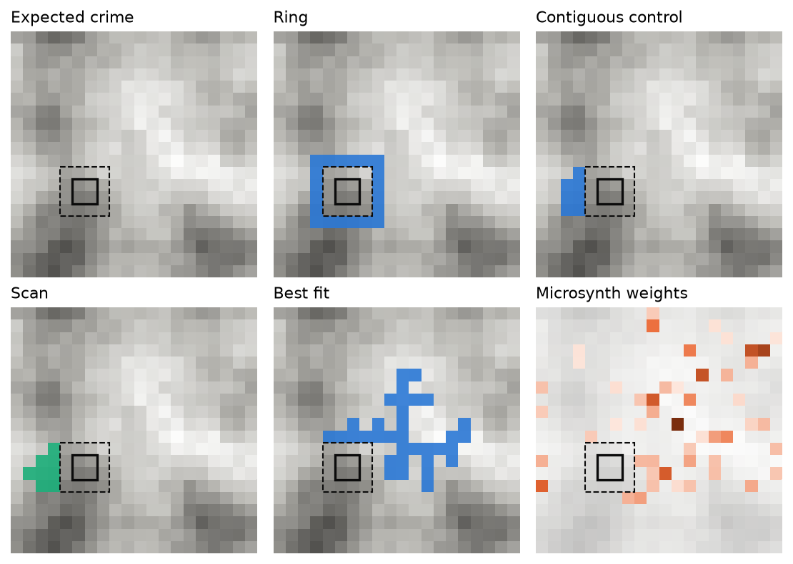
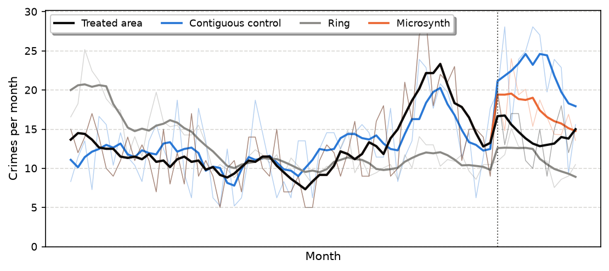
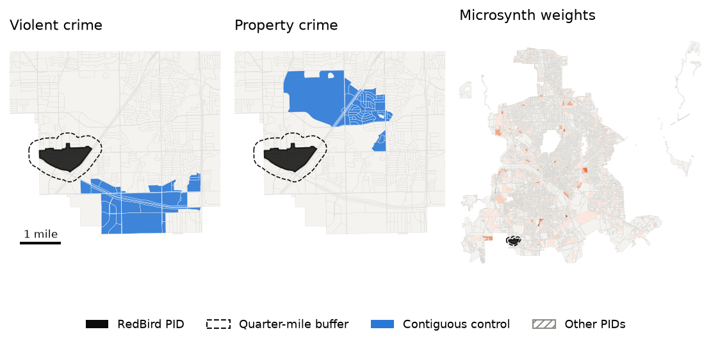
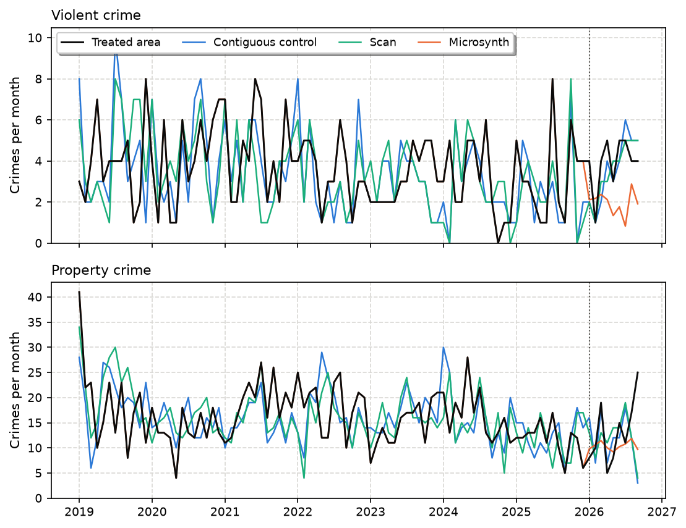
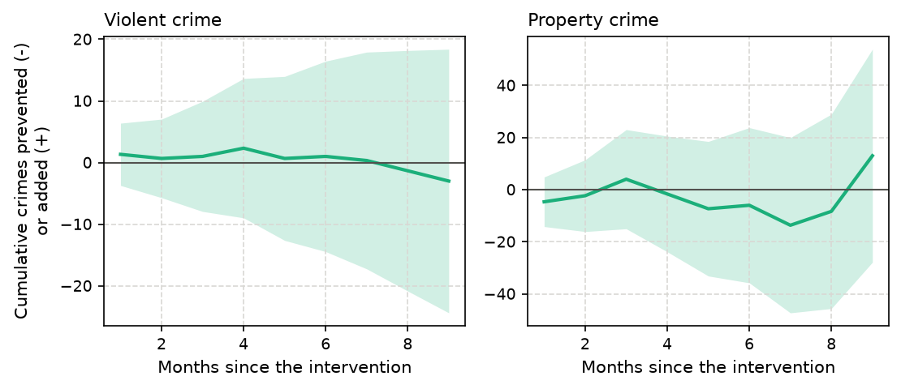
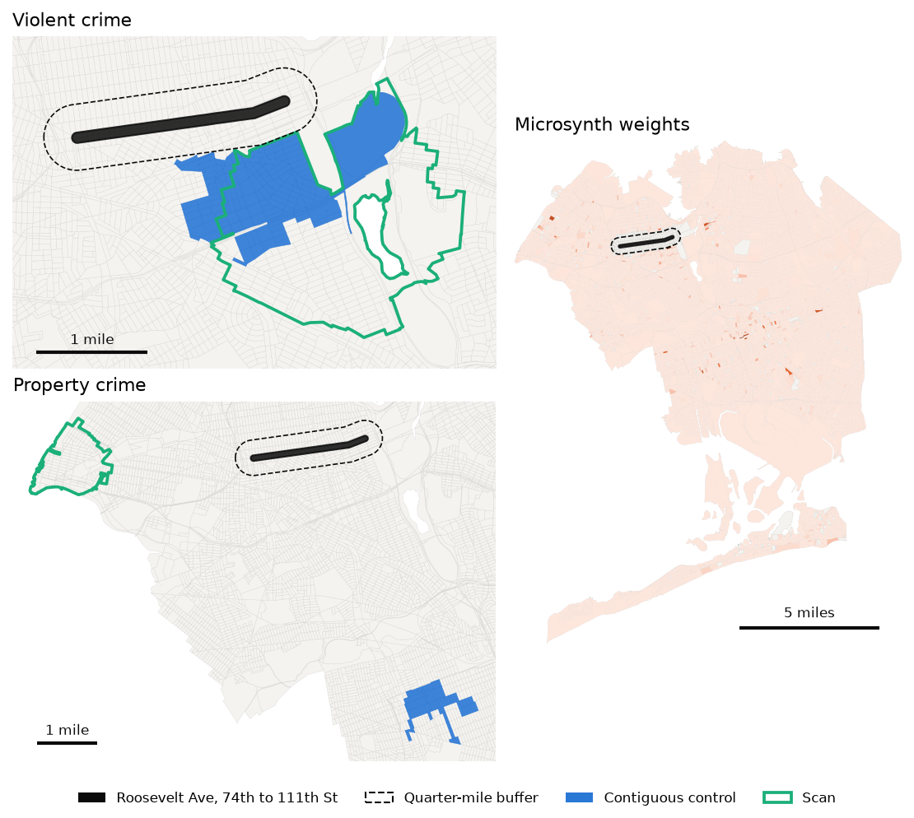
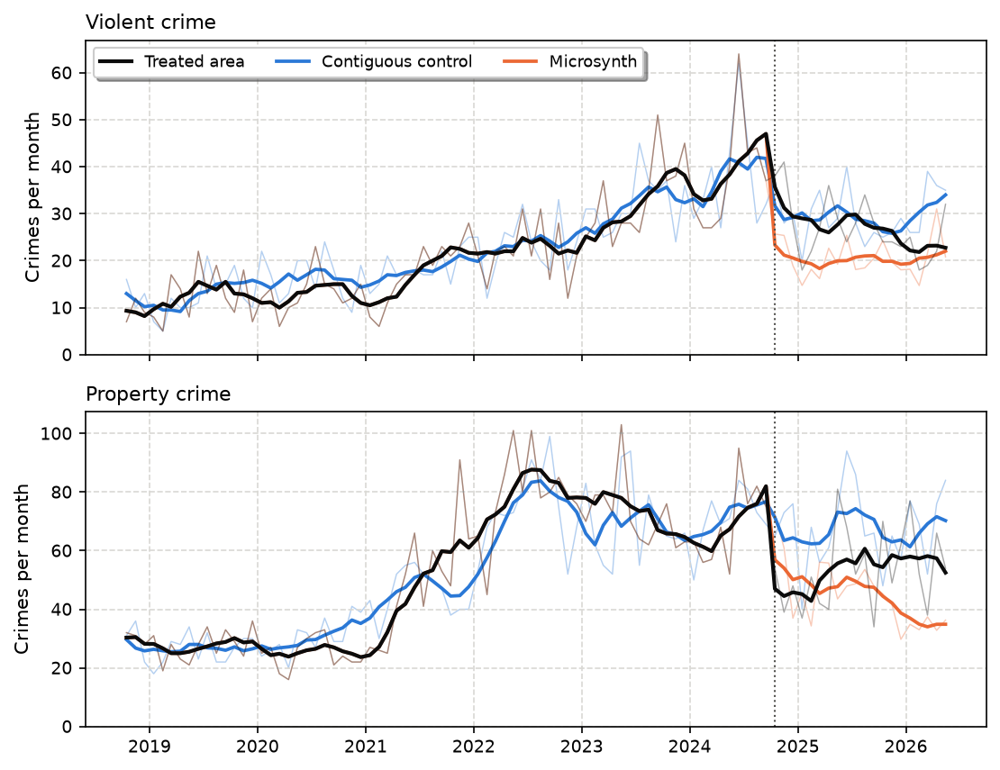
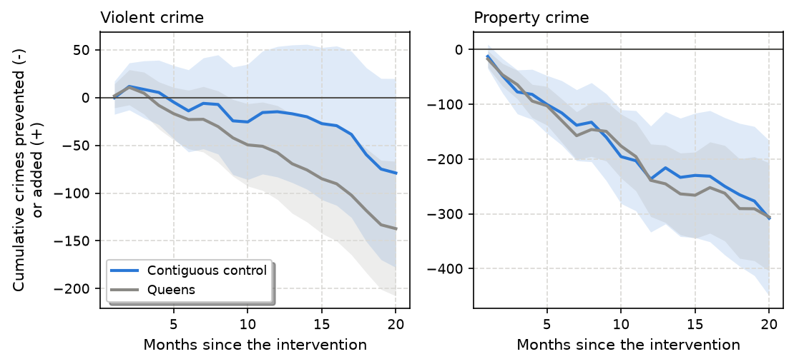

# Drawing contiguous control areas for the weighted displacement difference test
Andrew P. Wheeler

# Introduction

A police department puts extra patrols in a hot spot, a city funds a business improvement district, or a task force cleans up a commercial corridor. Afterwards someone asks whether crime went down. The weighted displacement difference (WDD) test ([Wheeler and Ratcliffe 2018](#ref-wheeler2018wdd)) is a simple answer that crime analysts can compute by hand: compare the change in crime in the treated area with the change in a control area, and attach a Poisson standard error. The test is only as good as the control area, though, and in practice the analyst draws it by eye, as a ring around the treated area, the rest of the police beat, or a neighborhood that “looks similar.”

Synthetic control methods ([Abadie and Gardeazabal 2003](#ref-abadie2003); [Abadie, Diamond, and Hainmueller 2010](#ref-abadie2010)) replace that judgment with an optimization: weight untreated units so their weighted sum tracks the treated unit before the intervention. For crime at small geographies, microsynth ([Robbins, Saunders, and Kilmer 2017](#ref-robbins2017); [Robbins and Davenport 2021](#ref-robbins2021)) calibrates a weight for every untreated micro area so that weighted pre-period counts match the treated area’s exactly. The result is not an area. It is hundreds or thousands of blocks scattered across a city, each carrying a fractional weight, which is hard to explain to a city council, hard to check against local knowledge (did one of those blocks lose a big store?), and does not fit the WDD’s logic of counting crimes in a place.

This paper describes a method to draw the control area as a single, contiguous geographic area, with no weights, whose monthly crime before the intervention tracks the treated area’s in the same way a synthetic control does: plot the two series and they move together. Given small units (census blocks or grid cells), their adjacency, and the treated area, it searches for a connected set of units outside a buffer around the treated area whose summed monthly counts follow the treated counts. The search combines a network scan, which grows candidate areas outward from many possible centers through the adjacency graph, with a small integer program inside each scan window that picks which units to keep. A constraint that every selected unit borders a selected unit closer to the window’s center guarantees the area is connected and keeps each integer program small enough to solve in about a second.

A second contribution concerns how close a match to ask for. With thousands of candidate areas, the best-fitting one matches the noise in the treated series, not just its trend, and in simulations below that makes the effect estimate worse, not better. I instead require the control to be statistically indistinguishable from the treated area before the intervention, month to month, over six-month stretches, and in overall level and trend, judged against what Poisson noise alone would produce. Among the areas that pass, the method picks the one nearest the treated area. The rule is fast and easy to explain: the control area is the closest contiguous area whose pre-intervention crime is indistinguishable from the treated area’s.

I illustrate the method on synthetic grids, where the true effect is known, and compare it with control areas analysts commonly use (a surrounding ring and the whole city), a pure scan, the best-fitting contiguous area, and a Python replication of microsynth. I then apply it to two interventions with open crime data: the RedBird public improvement district in Dallas, Texas, which began its first year of services in 2026, and Operation Restore Roosevelt, a 2024 multi-agency enforcement operation on Roosevelt Avenue in Queens, New York. For the second I show how the chosen control area turns the WDD into a running, month-by-month tally of crimes prevented, the kind of counter that can be updated at each CompStat meeting ([Wheeler 2024](#ref-wheeler2024compstat)). Finding each control area takes 2.5 to 4.0 minutes on a four-core desktop computer.

# Background

## The WDD test

Let $T_0$ and $T_1$ be crime counts in the treated area before and after an intervention, and $C_0$ and $C_1$ the counts in a control area over the same periods. The WDD estimate of crimes prevented (negative) or added (positive) is the difference in differences

```math
\widehat{\Delta} = (T_1 - T_0) - (C_1 - C_0),
```

and if the four counts are independent Poisson variables its variance is $T_0 + T_1 + C_0 + C_1$ ([Wheeler and Ratcliffe 2018](#ref-wheeler2018wdd)). The original test also has a displacement area around the treated area with its own control ([Bowers and Johnson 2003](#ref-bowers2003); [Guerette and Bowers 2009](#ref-guerette2009)); I leave displacement aside, since the question here is how to choose the control.

The estimate is unbiased if, absent the intervention, the treated area’s count would have changed by the same number of crimes as the control’s. That is a parallel trends assumption in counts. It is most plausible when the control has about as much crime as the treated area and has followed the same path over time. A control area with twice the crime will, if crime moves proportionally, change by twice as many crimes, so the analyst should either pick a control of similar volume or scale it: a control with $k$ times the treated area’s crime enters as $(C_1 - C_0)/k$, with variance $(C_0 + C_1)/k^2$. Both the volume and the path are visible before the intervention, which is what synthetic control methods exploit.

## Synthetic controls and microsynth

The synthetic control method ([Abadie and Gardeazabal 2003](#ref-abadie2003); [Abadie, Diamond, and Hainmueller 2010](#ref-abadie2010); [Abadie 2021](#ref-abadie2021)) builds a counterfactual for one treated unit as a weighted average of untreated units, with non-negative weights chosen to reproduce the treated unit’s pre-intervention outcomes. Saunders et al. ([2015](#ref-saunders2015)) adapted it to place-based crime interventions. Robbins, Saunders, and Kilmer ([2017](#ref-robbins2017)) extended it to micro-level data, where the treated area is made up of many small units and there are thousands of potential donors. Microsynth finds weights by survey calibration ([Deville and Särndal 1992](#ref-deville1992)): each untreated unit’s weight is as close as possible to a common base weight, subject to the weighted sums exactly matching the treated area’s totals on the pre-period outcomes in each time period (and any covariates). With the raking distance this is the convex program

```math
\min_{w \ge 0} \sum_i \left[ w_i \log(w_i/d_i) - w_i + d_i \right]
\quad \text{subject to} \quad \sum_i w_i x_{it} = y_t \;\; \text{for all } t,
\quad \sum_i w_i = n_T,
```

where $x_{it}$ are untreated units’ counts, $y_t$ the treated area’s counts, $n_T$ the number of treated units and $d_i = n_T / n$ the base weight. The weights spread over the whole study region.

## Contiguity and scan statistics

Requiring a set of selected areas to be connected is a familiar constraint in districting and spatial optimization. Exact formulations use network flows ([Shirabe 2005](#ref-shirabe2005)) or cut constraints added as needed ([Validi, Buchanan, and Lykhovyd 2022](#ref-validi2022)). Wheeler ([2019](#ref-wheeler2019pmed)) uses a simpler version for patrol districts: each area assigned to a district must border another assigned area that is closer to the district’s center. That idea is what makes the method here fast. Scan statistics ([Kulldorff 1997](#ref-kulldorff1997)) search over many candidate zones, classically circles of increasing radius around every location; flexibly shaped scans ([Tango and Takahashi 2005](#ref-tango2005)) grow connected zones through the adjacency graph instead. The method below is a scan in that sense, but it optimizes the shape within each window rather than enumerating shapes.

# Method

## Setup

Divide the study region into small units $i = 1, \dots, N$ (census blocks in the case studies, grid cells in the simulations), with an adjacency graph connecting units that share a boundary (rook contiguity, so blocks that only touch at a corner are not neighbors). The treated area is given. Units within a buffer distance of it are removed, so the control area is not contaminated by spillover or displacement, as are any units the analyst wants to exclude (for example, other places receiving the same kind of intervention). The remaining units are candidates, and the control area must be connected through candidate units alone.

Let $y_t$ be the treated area’s crime count in pre-intervention month $t = 1, \dots, P$ and $x_{it}$ unit $i$’s. For a candidate control area $S$ the monthly gap is

```math
D_t(S) = \sum_{i \in S} x_{it} - k\, y_t .
```

I use $k = 1$ throughout, so the control area should have the same crime as the treated area in every month, which matches both the volume and the trend.

## How close a match to ask for

The obvious objective is to minimize the total absolute gap $F(S) = \sum_t |D_t(S)|$. With thousands of units there are astronomically many connected areas, and the best one fits the treated series more closely than its noise allows. Suppose instead a control’s expected counts were exactly $k$ times the treated area’s expected counts $\mu_t$. The gap would still have variance $v_t = \phi (k + k^2)\mu_t$, where $\phi = 1$ for Poisson counts and $\phi > 1$ for overdispersed counts, and expected absolute value about $\sqrt{2 v_t/\pi}$. I estimate $\mu_t$ by $y_t$ and $\phi$ by the treated series’ Pearson dispersion around its seven-month centered moving average (at least one). Monthly crime counts for small areas are often overdispersed, and with pure Poisson thresholds few areas pass for the more variable series. A control area *passes* if all four of these summaries are within what a perfect match would produce:

1.  the monthly fit $\sum_t |D_t|$ is at most $\tau = \sum_t \sqrt{2 v_t / \pi}$;
2.  the six-month fit $\sum_b |\sum_{t \in b} D_t|$, over consecutive six-month blocks $b$ ending at the intervention, is at most $\tau_6 = \sum_b \sqrt{2 V_b / \pi}$ with $V_b = \sum_{t \in b} v_t$, so the two series also track each other over the medium term, where a plot’s smoothed lines would show a drift that monthly noise hides;
3.  the level gap $|\sum_t D_t|$ is at most one standard deviation, $\sqrt{\sum_t v_t}$;
4.  the trend gap $|\sum_t (t - \bar t) D_t|$ is at most one standard deviation, $\sqrt{\sum_t (t - \bar t)^2 v_t}$.

The violation of an area is the largest of the four ratios of a summary to its threshold, so an area passes when its violation is at most one.

Among passing areas the method picks the one nearest the treated area. Nearby places share more of the unmeasured things that drive crime trends, and analysts already reach for nearby comparison areas. The search also reports the next-best distinct passing areas, so the analyst can see how much the estimate depends on the choice and can bring local knowledge to it. If no area passes, the search returns the area with the smallest violation.

## The search

*Windows.* From a center unit $c$, order candidate units by their shortest-path distance $d_c(i)$ through the adjacency graph, where each edge is as long as the distance between the two units’ centers. The window $W_c$ is the nearest units holding three times the treated area’s pre-period crime (at most 600 units), enough room to choose from. Every candidate unit with any crime can be a center; in the case studies I thin centers to one per 800-foot grid cell, since windows centered on neighboring blocks are nearly identical.

*Screening.* Two quick fits are computed in every window. The pure scan takes the shortest prefix of the distance ordering that passes (or the prefix with the smallest violation), a “network circle” around $c$. A greedy fit starts from $c$ and repeatedly adds the unit that most reduces the violation, among units adjacent to one already selected and closer to $c$, stopping when the area passes or nothing helps. Windows are ranked by their best screening result (passing windows by distance from the treated area, then the rest by violation), and the top 50 go to the integer program.

*Integer program.* Within window $W_c$, let $z_i \in \{0, 1\}$ indicate a selected unit and $o_t, u_t \ge 0$ the over- and under-count in month $t$, so $o_t - u_t = D_t$. Write $\tilde d_i$ for unit $i$’s network distance from the center rescaled to mean one, $N_c(i)$ for the neighbors of $i$ in the window that are closer to $c$, and $s \ge 0$ for a slack. The program is

```math
\begin{aligned}
\min \quad & \sum_{i \in W_c} \tilde d_i z_i + M s + \epsilon F / \tau \\
\text{s.t.} \quad & \sum_{i \in W_c} x_{it} z_i - o_t + u_t = k\, y_t && \text{for all } t \\
& \textstyle\sum_t (o_t + u_t) \le \tau (1 + s), \quad \sum_b e_b \le \tau_6 (1 + s), \quad
  e_b \ge \pm \sum_{t \in b} (o_t - u_t) \\
& \textstyle\left|\sum_t (o_t - u_t)\right| \le \ell (1 + s), \quad
  \left|\sum_t (t - \bar t)(o_t - u_t)\right| \le \sigma (1 + s) \\
& z_i \le \sum_{j \in N_c(i)} z_j && \text{for all } i \in W_c,\; i \ne c \\
& z_c = 1, \quad z_i \in \{0, 1\}, \quad o_t, u_t, e_b, s \ge 0,
\end{aligned}
```

where $\ell$ and $\sigma$ are the level and trend thresholds. The objective is the p-median measure of compactness, the summed distance of selected units from the center ([Wheeler 2019](#ref-wheeler2019pmed)). The slack keeps the program feasible when no subset of the window passes; its penalty $M$ is 100 times the window’s total distance, so any subset that passes beats any that misses. The small $\epsilon$ term breaks ties toward better fits.

The last constraint does the work. Every selected unit other than the center must border a selected unit strictly closer to the center. Following those neighbors from any selected unit traces a path of strictly decreasing distance that must end at $c$, so every feasible solution is a connected area containing $c$. No unit is ruled out, since a unit’s predecessor on its shortest path to $c$ is a closer neighbor. The constraint restricts the shape, which must be star-shaped around its center in network distance, but that is a compactness requirement an analyst would want anyway, and the scan over centers recovers areas centered anywhere. It needs one constraint per unit, against the many cut constraints or flow variables of an exact contiguity formulation ([Validi, Buchanan, and Lykhovyd 2022](#ref-validi2022)), so each window’s program solves with HiGHS ([Huangfu and Hall 2018](#ref-huangfu2018)) within a two-second limit. (When the limit is reached the best solution found is used; because the final choice is the nearest window holding a passing area, it rarely depends on how far the solver got within a window.)

*No holes.* A control area should be a single area an analyst can outline, with no unselected pockets inside it. Two more sets of linear constraints rule out the simplest holes: a unit whose neighbors all lie in the window must be selected if all of them are, $z_i \ge \sum_{j \in N(i)} z_j -
(\text{deg}_i - 1)$, and a unit that cannot be selected (in the buffer, or excluded) must not be completely surrounded, $\sum_{j \in N(u)} z_j \le
\text{deg}_u - 1$. Units on the edge of the study region are exempt, since they cannot be enclosed. Any larger pocket of eligible units that is still enclosed after solving is added to the area, the filled area is checked again, and areas are ranked by their filled versions, so every area the search reports, including the scan’s network circles, has no holes.

*Shape refinement.* Minimizing distance alone selects the units it needs and connects them with as few others as possible, which can leave thin tendrils. For the eight best passing areas the program is solved again with the area’s perimeter added to the objective, counted as adjacencies between a selected and an unselected unit, $\sum_i \text{deg}_i z_i - 2 \sum_{(i,j)} w_{ij}$ with $w_{ij} \le z_i$ and $w_{ij} \le z_j$ for each adjacent pair, warm-started from the first solution and allowed ten seconds. That trims tendrils and rounds out the boundary whenever doing so keeps the area passing.

*One place should not be the control.* A census block holding a big-box store or a large apartment complex can carry a large share of an area’s crime, and its counts can jump or vanish for reasons unrelated to the intervention (the store closes, or changes how it reports shoplifting). Synthetic control practice already advises dropping donors hit by such idiosyncratic shocks ([Abadie 2021](#ref-abadie2021)). Because the post-period should not be used to choose the control, I apply a design-stage rule instead: in the case studies, no block holding more than 20% of the treated area’s pre-period crime can be part of any method’s control. <a href="#sec-nyc" class="quarto-xref">Section 6</a> shows what this guards against.

## Comparison control areas

I compare the contiguous control area with five alternatives.

- *Ring:* candidate units in the band just outside the buffer (from one to two times the buffer distance from the treated area), a common informal choice, scaled by its pre-period crime relative to the treated area’s.
- *City:* every candidate unit, scaled the same way, which amounts to comparing the treated area’s change with the city-wide (or borough-wide) trend.
- *Scan:* the best network circle from the screening step: contiguous and passing if any circle passes, but with no shape optimization.
- *Best fit:* the contiguous area minimizing $F(S)$, from the same search with the fit as the objective and no thresholds.
- *Microsynth:* raking weights over every candidate unit matching the treated area’s monthly pre-period counts and the number of treated units exactly, as above. I match only the monthly outcome counts, not covariates, so every method sees the same information.

I compute microsynth’s weights with the raking algorithm of survey calibration ([Deville and Särndal 1992](#ref-deville1992)), Newton’s method on the dual of the problem above, which reproduces the convex program’s solution. When the intercept constraint makes exact calibration infeasible, as it does when the treated area is much hotter per unit than typical donors, I drop it and calibrate on the outcomes alone, which is microsynth’s own fallback of matching fewer variables exactly.

For the weighted microsynth control, the WDD uses weighted counts $C_0 = \sum_i w_i c_{0i}$ and $C_1 = \sum_i w_i c_{1i}$, with Poisson variance $\sum_i w_i^2 (c_{0i} + c_{1i})$ for the control part. All WDD estimates compare equal-length windows before and after the intervention. The WDD’s Poisson standard error can be put on the same quasi-Poisson footing as the thresholds by multiplying it by $\sqrt{\phi}$; I report both.

## A running WDD

Once the control area is chosen, the WDD can be tracked month by month after the intervention, the cumulative counter of crimes prevented that Wheeler ([2024](#ref-wheeler2024compstat)) suggests for CompStat follow-up. With $T_j$ and $C_j$ the counts in post month $j$ and a baseline of $B$ months before the intervention, the running estimate after $m$ months is

```math
\widehat{\Delta}_m = \sum_{j=1}^{m} (T_j - C_j) - \frac{m}{B} \sum_{\text{baseline}} (T - C),
\qquad
\operatorname{Var}(\widehat{\Delta}_m) = \sum_{j=1}^{m} (T_j + C_j) + \left(\frac{m}{B}\right)^2 \sum_{\text{baseline}} (T + C),
```

the crimes prevented so far relative to the baseline gap. At $m = B$ it is the WDD over equal windows. Because the control area is matched to the treated area month by month, the plot of the running estimate starts at zero and moves only when the treated area departs from its control.

# Synthetic data

## Design

Each synthetic world is simulated on a 40 by 40 grid of fine cells with 60 months before an intervention and 12 after, and analyzed on a 20 by 20 grid of coarse cells, each summing a 2 by 2 block of fine cells. A fine cell’s expected monthly count is $\lambda_{it} = \exp(\mu + a_i + b_i t/12 + c_i g(t) + s(t))$, where $a_i$ is a spatially smooth level (a Gaussian random field plus cell-level noise), $b_i$ a spatially smooth yearly trend, $c_i g(t)$ a temporary rise or fall peaking mid pre-period with a smooth field $c_i$, and $s(t)$ a common seasonal cycle. Counts are Poisson with gamma-distributed overdispersion. The treated area is a 4 by 4 block of fine cells (2 by 2 coarse cells) drawn among the hottest 10% of such blocks, as interventions target hot spots, and the ring of coarse cells around it is excluded as a buffer. After the intervention its crime falls by 20%. The WDD compares the last 12 pre-period months with the 12 post-period months, and its target is the expected number of crimes prevented, $-0.2$ times the treated area’s expected post-period crime.

Two scenarios differ in how local the trends are. In the *smooth* scenario the trend field varies only over long distances (about three coarse cells), so the treated hot spot’s neighbors share its trend. In the *local* scenario the trend adds a short-range field (about one coarse cell), and the treated hot spot is drawn from the quarter of hot spots whose short-range trend is highest: crime there was rising relative to its surroundings, as it often is where interventions are placed. I draw 50 worlds in each scenario. To keep the simulations quick, every cell with crime is a scan center, the integer program runs in the best 20 windows with a one-second limit, and only the chosen area’s shape is refined; there is no single-place cap, since no synthetic cell carries a store. The ring is the band of coarse cells just outside the buffer.

## An example

<a href="#fig-sim-map" class="quarto-xref">Figure 1</a> shows one world from the local scenario and the control areas each method chooses. The ring surrounds the buffer. The contiguous control is a compact area of 7 cells just outside the buffer, and the scan’s network circle is next to it. The best-fitting area sprawls across 34 cells, and microsynth spreads its weight over 50 cells across the whole grid. <a href="#fig-sim-series" class="quarto-xref">Figure 2</a> shows the monthly series. In this world the true effect is -62 crimes; the part of the WDD error due to non-parallel expected trends is +13 for the contiguous control and +31 for the ring.





## Monte Carlo results

<div class="cell-output cell-output-display cell-output-markdown" execution_count="5">

| Scenario | Control    | Bias | RMSE | Trend RMSE | Mean SE | Coverage (%) | Passes | Cells |
|:---------|:-----------|-----:|-----:|-----------:|--------:|-------------:|-------:|------:|
| Smooth   | Contiguous |   +2 |   58 |         18 |      39 |      94 / 94 |   100% |     8 |
| Smooth   | Scan       |   -5 |   65 |         20 |      39 |      84 / 88 |    94% |    14 |
| Smooth   | Best fit   |   +1 |   58 |         17 |      39 |      88 / 88 |    50% |    29 |
| Smooth   | Ring       |   +7 |   51 |         17 |      32 |      92 / 94 |    46% |    20 |
| Smooth   | City       |  +19 |   57 |         38 |      28 |      80 / 88 |    28% |   384 |
| Smooth   | Microsynth |  +12 |   71 |         26 |      41 |      76 / 94 |    76% |    52 |
| Local    | Contiguous |  +40 |  111 |         83 |      53 |      72 / 86 |    78% |    13 |
| Local    | Scan       |  +38 |  103 |         94 |      53 |      80 / 88 |    58% |    14 |
| Local    | Best fit   |  +67 |  145 |        109 |      53 |      68 / 78 |    36% |    26 |
| Local    | Ring       | +134 |  218 |        203 |      44 |      52 / 54 |     4% |    20 |
| Local    | City       | +144 |  241 |        228 |      38 |      36 / 44 |     6% |   384 |
| Local    | Microsynth |  +91 |  160 |        115 |      58 |      72 / 78 |    56% |    43 |

</div>

<a href="#tbl-sim" class="quarto-xref">Table 1</a> summarizes the 50 worlds in each scenario. The true effect averages -92 crimes in the smooth scenario and -195 in the local one, where the rising hot spots have more crime.

In the smooth scenario every local control shares the treated area’s trend, and the trend errors of the ring, the scan, the best fit, and the contiguous control are all small (trend RMSE 17 to 20). The contiguous control is essentially unbiased (+2). The ring has the smallest overall error (RMSE 51 against 58 for the contiguous control), because it holds several times the treated area’s crime and scaling it down shrinks its noise. The city-wide trend misses local trends, and microsynth is the least accurate control (RMSE 71) even though it matches the pre-period months exactly whenever that is feasible.

The local scenario is the one matching is for. The treated hot spot’s crime was rising relative to its surroundings, so the ring and the city-wide trend are badly biased: +134 and +144 crimes, against a true effect of -195, so on average they miss 69% and 74% of the reduction. The contiguous control cuts the bias to +40 and has the smallest trend error (RMSE 83, against 203 for the ring). It does not remove the bias: a contiguous area has to include whatever lies between the places whose trends match, and with noisy series an area can pass the checks while its trend still differs. The best-fitting area, which chases noise, is more biased (+67), and so is microsynth (+91).

Two other results matter for practice. First, the pure scan does about as well as the integer program (RMSE 103 and 65 against 111 and 58): most of the gain comes from requiring the pre-period match and taking the nearest area that meets it, while the integer program finds a passing area more often (78% of local worlds against 58% for the scan) and controls its shape. Second, the WDD’s intervals cover the true effect about as often as they should for the contiguous control in the smooth scenario (94%), but in the local scenario no control’s 95% interval reaches its nominal coverage. The Poisson standard error ignores both overdispersion and the uncertainty in the control’s trend; inflating it by $\sqrt{\phi}$ helps (72% to 86% for the contiguous control in the local scenario) but does not close the gap. Finding a control area took about 11 seconds per world.

# Case study 1: the RedBird public improvement district, Dallas

The former Red Bird Mall in southern Dallas was defunct when a developer bought it in 2015 and began rebuilding it as a mixed-use district with medical clinics, a Dallas College workforce center, and an entrepreneurship center ([The LAB Report Dallas 2026](#ref-labreport2026)). In 2025 property owners petitioned for a public improvement district, and the Dallas City Council created the RedBird PID on May 28, 2025, for a ten-year term from January 1, 2026 through 2035 ([City of Dallas 2025](#ref-dallas2025pid)). Its service plan funds public safety and enhanced security, lighting and signage, and marketing, from an assessment of about \$0.15 per \$100 of property value, around \$300,000 a year. The district covers 317 acres around the former mall, from U.S. Highway 67 west to Cockrell Hill Road and from Camp Wisdom Road south to Interstate 20. Similar districts elsewhere have been credited with reducing crime ([MacDonald et al. 2010](#ref-macdonald2010); [Cook and MacDonald 2011](#ref-cook2011)). PID revenue lags its creation, and local reporting describes the district’s new security measures as starting in August 2026, funded in the meantime by \$200,000 of the council district’s pandemic recovery money ([The LAB Report Dallas 2026](#ref-labreport2026)). The nine months of data after January 1, 2026 therefore mostly precede the district’s full services. The case study is an illustration of choosing the control area, not a final evaluation of the district.

I use Dallas Police Department incidents from the city’s open data portal, January 2019 through September 2026. Violent crime is murder, aggravated assault, and robbery; property crime is burglary, larceny, and motor vehicle theft. An incident with several offenses counts once, as its most serious offense, and family-violence aggravated assaults are almost entirely withheld from the public file. There are 32,894 violent and 312,793 property incidents in the seven pre-intervention years. Incidents are assigned to the 18,946 2020 census blocks with land area inside the city. The treated counts are incidents inside the PID boundary, from the city’s GIS layer, or within 100 feet of it, which picks up the boundary streets. In 2025 the district had 40 violent and 140 property incidents. Blocks within a quarter mile of the district are excluded as a buffer, as are blocks touching any of the city’s other 17 improvement districts. The search matches the 84 months from January 2019 through December 2025, and the WDD compares the nine months after January 1, 2026 with the nine months before.





<div class="cell-output cell-output-display cell-output-markdown" execution_count="9">

| Crime    | Control    | Blocks |      k | Violation |     C0 |     C1 | WDD (SE) |    95% CI |
|:---------|:-----------|-------:|-------:|----------:|-------:|-------:|---------:|----------:|
| Violent  | Contiguous |     73 |   1.00 |      1.00 |     20 |     32 |  -6 (11) | -27 to 15 |
| Violent  | Scan       |    127 |   1.00 |      0.99 |     23 |     32 |  -3 (11) | -24 to 18 |
| Violent  | Best fit   |    142 |   1.00 |      0.49 |     31 |     30 |  +7 (11) | -15 to 29 |
| Violent  | Ring       |     32 |   0.13 |      5.58 |      3 |      3 |  +6 (21) | -35 to 47 |
| Violent  | City       | 17,387 |  86.10 |      1.20 |  2,110 |  1,785 |  +10 (8) |  -6 to 26 |
| Violent  | Microsynth |    418 |   1.00 |      0.00 |     29 |     18 |  +17 (9) |   0 to 35 |
| Property | Contiguous |     46 |   1.00 |      1.00 |    105 |    105 | +15 (21) | -26 to 56 |
| Property | Scan       |    110 |   1.00 |      0.97 |    106 |    108 | +13 (21) | -28 to 54 |
| Property | Best fit   |    210 |   1.00 |      1.10 |    130 |    137 |  +8 (22) | -35 to 51 |
| Property | Ring       |     32 |   0.31 |      4.39 |     31 |     23 | +41 (28) | -14 to 96 |
| Property | City       | 17,293 | 153.80 |      1.21 | 19,043 | 17,326 | +26 (15) |  -3 to 55 |
| Property | Microsynth | 10,456 |   1.00 |      0.00 |    103 |     94 | +24 (16) |  -7 to 56 |

</div>

The search screened 4,600 windows for violent crime and 7,365 for property crime, and took 2.5 and 4.0 minutes. The estimated dispersion of the district’s monthly counts is 1.00 for violent and 1.41 for property crime. <a href="#fig-dallas-map" class="quarto-xref">Figure 3</a> shows the two control areas. For violent crime it is 73 blocks (2.4 square miles) south of the district, across Interstate 20; for property crime, 46 blocks (0.8 square miles) north of it. Both are larger than the half-square-mile district, because the former mall has more crime per square mile than the neighborhoods around it. The scan’s network circles cover much of the same ground but are larger. Microsynth, by contrast, puts weight on 418 blocks across the city for violent crime and 10,456 for property crime. <a href="#fig-dallas-series" class="quarto-xref">Figure 4</a> shows that the contiguous controls track the district’s monthly crime from 2019 through 2025, including the fall in property crime in 2019 and 2020 and its rise in 2021 and 2022. The scan’s network circles, which also pass the checks (violations of 0.99 and 0.97), track it about as closely. Microsynth’s weighted series reproduces the district’s monthly counts exactly (its line lies under the treated area’s before 2026).

<a href="#tbl-dallas" class="quarto-xref">Table 2</a> gives the WDD estimates. Violent crime in the district went from 29 incidents in the nine months before January 2026 to 35 in the nine months after, in line with local reports of rising violence in part of the district ([The LAB Report Dallas 2026](#ref-labreport2026)), but its contiguous control rose by more, and the WDD is -6 (SE 11). Property crime went from 103 to 118, and the WDD against its contiguous control is +15 (SE 21). Neither is distinguishable from no change, which is what one would expect of a district whose services had barely begun.

The comparison controls show why the choice matters. The ring around the buffer has only 13% of the district’s violent crime and 31% of its property crime: the former mall is a hot spot relative to its immediate surroundings, and scaling up so small a control inflates its noise (standard errors of 21 and 28). The city-wide trend fails the pre-period checks for both crime types. Microsynth gives the largest violent crime estimate, +17 (SE 9), with an interval that just excludes zero: its weighted control fell from 29 to 18 crimes while the contiguous areas rose. Matching every pre-period month exactly, noise included, is what the simulations show produces erratic estimates.



The running WDD works with any control area. <a href="#fig-dallas-cumulative" class="quarto-xref">Figure 5</a> tracks the district month by month against the scan’s network circle. Violent crime never strays more than 3 crimes from its control’s path and ends at -3; property crime moves between -14 and +13 and ends at +13. Neither interval excludes zero in any month, the same answer as the contiguous control in <a href="#tbl-dallas" class="quarto-xref">Table 2</a>.

# Case study 2: Operation Restore Roosevelt, Queens

Operation Restore Roosevelt began on October 15, 2024: a 90-day, multi-agency enforcement push by the New York Police Department, with state troopers, on Roosevelt Avenue from 74th Street to 111th Street in Jackson Heights, Elmhurst, and Corona, Queens, aimed at brothels, illegal street vending, retail theft and the sale of stolen goods, and unlicensed vehicles ([Queens Daily Eagle 2024](#ref-queenseagle2024); [City of New York, Office of the Mayor 2024](#ref-nyc2024roosevelt)). The city’s announcement also notes that over the preceding year the police had already been addressing prostitution, unlicensed vending, and retail theft on the corridor ([City of New York, Office of the Mayor 2024](#ref-nyc2024roosevelt)), so the operation intensified enforcement that had been building. It was extended after the first 90 days. In January 2025 the police commissioner credited it with a 25% reduction in crime in the area ([QNS 2025](#ref-qns2025)).

I use NYPD complaint records for Queens from the city’s open data portal (the historic file through 2025 and the year-to-date file through June 2026). Violent crime is murder, robbery, and felony assault; property crime is burglary, grand and petit larceny, and motor vehicle theft. Complaints are assigned to the 13,926 2020 census blocks with land area in Queens. The treated area is the TIGER centerline of Roosevelt Avenue between the two cross streets, about two miles, buffered by 250 feet to take in the avenue and the buildings fronting it. In the year before the operation it had 462 violent and 824 property complaints. Months run from the 15th to the 14th. The search matches the 72 months before the launch (October 15, 2018 to October 14, 2024), blocks within a quarter mile of the corridor are excluded, and the WDD compares the 20 months after the launch, through June 14, 2026, with the 20 months before.





<div class="cell-output cell-output-display cell-output-markdown" execution_count="14">

| Crime    | Control    | Blocks |     k | Violation |     C0 |     C1 |  WDD (SE) |       95% CI |
|:---------|:-----------|-------:|------:|----------:|-------:|-------:|----------:|-------------:|
| Violent  | Contiguous |    180 |  1.00 |      1.00 |    695 |    596 |  -79 (50) |   -178 to 20 |
| Violent  | Scan       |    375 |  1.00 |      1.21 |    688 |    629 | -119 (51) |  -218 to -20 |
| Violent  | Best fit   |    381 |  1.00 |      2.65 |    737 |    693 | -134 (52) |  -236 to -32 |
| Violent  | Ring       |    248 |  1.19 |      3.79 |    725 |    552 |  -33 (46) |   -124 to 58 |
| Violent  | Queens     | 13,595 | 27.24 |      6.35 | 13,989 | 12,879 | -137 (36) |  -208 to -67 |
| Violent  | Microsynth | 12,195 |  1.00 |      0.00 |    718 |    412 | +128 (45) |    40 to 217 |
| Property | Contiguous |     88 |  1.00 |      1.00 |  1,352 |    902 | +100 (69) |   -35 to 235 |
| Property | Scan       |    171 |  1.00 |      2.31 |  1,433 |  1,513 | -430 (74) | -575 to -285 |
| Property | Best fit   |    230 |  1.00 |      2.45 |  1,388 |    893 | +145 (69) |    10 to 280 |
| Property | Ring       |    247 |  1.45 |      8.91 |  1,659 |  1,320 | -116 (63) |    -238 to 7 |
| Property | Queens     | 13,582 | 48.98 |      8.17 | 57,332 | 55,164 | -306 (50) | -405 to -207 |
| Property | Microsynth |  9,796 |  1.00 |      0.00 |  1,423 |    895 | +178 (58) |    63 to 293 |

</div>



The violent crime control area is 180 blocks in Corona and Elmhurst, just south of the corridor and its buffer, including part of Flushing Meadows Corona Park (<a href="#fig-nyc-map" class="quarto-xref">Figure 6</a>; the white areas inside the park are lakes, which have no census blocks). The property crime control is 88 blocks around Ozone Park and Richmond Hill in southern Queens, 4.2 miles away; 13 blocks were excluded from every method’s pool by the single-place cap. The scan’s network circles are larger and, for property crime, in a different part of the borough. Microsynth again spreads its weight across the whole borough, over 12,195 of the 13,595 candidate blocks for violent crime and 9,796 of 13,582 for property crime. The monthly series are more variable than Poisson (estimated dispersion 1.52 for violent and 1.70 for property crime), and the searches took 3.1 and 4.0 minutes.

<a href="#fig-nyc-series" class="quarto-xref">Figure 7</a> shows why a matched control matters here. Violent crime on the corridor tripled over the matching period, from 146 complaints in its first year to 462 in the year before the operation, and its contiguous control followed the same rise. Property crime surged in 2021 and 2022, and its control follows that too; the scan’s network circle for property crime, which fails the checks (violation 2.31), visibly departs from the corridor in 2022 and 2023. The timing around the launch differs by crime type. Violent crime on the corridor peaked in the month starting June 15, 2024 (64 complaints) and had already fallen to 37 in the month before the operation, consistent with the enforcement the city says was already under way. Property crime fell right after the launch, from 75 complaints in the month before to 54 and 39 in the first two months.

<a href="#tbl-nyc" class="quarto-xref">Table 3</a> gives the estimates over the 20 months after the launch. Against its contiguous control, the WDD for violent crime is -79 (SE 50), a 13% reduction, and for property crime +100 (SE 69); both intervals include zero, and inflating the standard errors for overdispersion by $\sqrt{\phi}$ only widens them. The Queens-wide comparison, the closest analogue of the city’s claim, gives reductions of 20% and 22%, but it fails the pre-period checks: the corridor’s crime rose much faster than the borough’s before the operation. Microsynth again stands apart, with estimated *increases* of +128 (SE 45) and +178 (SE 58); its weighted violent crime control fell 43% after the launch, against 8% for Queens as a whole.

<a href="#fig-nyc-cumulative" class="quarto-xref">Figure 8</a> turns the comparison into the running tally an analyst would bring to CompStat meetings, and it shows what a single 20-month number hides. Against the contiguous control, property crime on the corridor fell from the first month: the tally reached -150 crimes by month 7, and its interval excluded zero through month 9, roughly the operation’s initial 90-day surge and the months after it. Then the corridor’s property crime climbed back while the control’s kept falling, and the tally ends at +100 after 20 months. The violent crime tally stays near zero for more than a year and then drifts down to -79, with an interval that includes zero throughout.

*The single-place cap.* Without the cap, the nearest passing area for property crime is a different, smaller set of 30 blocks, three of which hold 71% of its property complaints in the two years before the launch, all at chain or department stores. Complaints at one of them went from 314 in the two years before to 30 in the 20 months after, the kind of change a store closure or a change in how a store reports shoplifting produces. That control gives a WDD of -6. The map of the control area makes such a problem visible; a weight vector over thousands of blocks does not.

# How much does the choice of control area matter?

<div class="cell-output cell-output-display cell-output-markdown" execution_count="16">

| Case      | Crime    | Rank | Violation | Distance (mi) | Area (sq mi) | Blocks |  WDD (SE) |
|:----------|:---------|-----:|----------:|--------------:|-------------:|-------:|----------:|
| RedBird   | Violent  |    1 |      1.00 |           0.3 |         2.38 |     73 |   -6 (11) |
| RedBird   | Violent  |    2 |      0.95 |           1.9 |         0.90 |     19 |  +17 (10) |
| RedBird   | Violent  |    3 |      0.94 |           2.0 |         1.14 |     60 |   +3 (11) |
| RedBird   | Violent  |    4 |      1.00 |           1.7 |         1.05 |     55 |   +0 (11) |
| RedBird   | Violent  |    5 |      0.96 |           1.9 |         1.08 |     26 |  +16 (10) |
| RedBird   | Property |    1 |      1.00 |           1.1 |         0.76 |     46 |  +15 (21) |
| RedBird   | Property |    2 |      0.99 |           2.2 |         0.96 |     67 |  +45 (21) |
| RedBird   | Property |    3 |      1.00 |           2.9 |         1.04 |     43 |  +17 (21) |
| RedBird   | Property |    4 |      0.99 |           3.8 |         0.80 |     64 |   +8 (21) |
| RedBird   | Property |    5 |      1.00 |           4.2 |         0.70 |     83 |  +59 (19) |
| Roosevelt | Violent  |    1 |      1.00 |           0.3 |         1.33 |    180 |  -79 (50) |
| Roosevelt | Violent  |    2 |      0.98 |           3.7 |         0.34 |     54 |  +22 (49) |
| Roosevelt | Violent  |    3 |      1.05 |           3.9 |         0.35 |     62 |  +45 (49) |
| Roosevelt | Violent  |    4 |      1.13 |           0.8 |         1.66 |    223 |  +56 (48) |
| Roosevelt | Property |    1 |      1.00 |           4.2 |         0.48 |     88 | +100 (69) |
| Roosevelt | Property |    2 |      1.00 |           4.3 |         0.45 |     69 | +167 (68) |
| Roosevelt | Property |    3 |      1.00 |           4.2 |         0.99 |    103 | +310 (68) |
| Roosevelt | Property |    4 |      1.00 |           4.2 |         0.39 |     66 | +328 (67) |
| Roosevelt | Property |    5 |      1.01 |           4.3 |         0.79 |     68 | +318 (67) |

</div>

<a href="#tbl-alt" class="quarto-xref">Table 4</a> lists the best five distinct control areas from each search. For the RedBird district they tell a consistent story: every violent crime alternative gives an estimate within two standard errors of zero, and the property crime alternatives all point to a rise, from +8 to +59 crimes. For Roosevelt Avenue they do not. Violent crime estimates range from -79 to +56, and property crime estimates, all increases, from +100 to +328, although these areas matched the corridor’s pre-period crime about as well as noise allows. The spread between statistically equivalent controls is larger than any single estimate’s standard error.

Does the single-place cap drive the Queens property crime results? Every passing property crime area under the 20% cap is in the same part of southern Queens and implies an increase. Stricter caps change the answer but leave nothing that passes: excluding blocks with more than 10% of the corridor’s pre-period property crime (44 blocks), the best distinct areas have violations from 1.06 to 1.29 and give -209, -106, +225, -235, and +295; at 5% (90 blocks), violations from 1.32 and estimates of -507, -535, -319, -173, and -295. Block-level property crime on commercial corridors is dominated by shoplifting at a small number of stores, and stores open, close, and change how they report; for such series an analyst would do better to analyze shoplifting separately from other property crime.

The practical reading is that a single WDD estimate understates the uncertainty about the counterfactual when the treated series is as variable as it is here, and that reporting the estimate against several passing control areas is an honest and cheap check. For the RedBird district the check supports the main estimates; for Operation Restore Roosevelt it says the data do not pin down the operation’s effect, despite the large reductions a city-wide comparison suggests.

# Discussion

The WDD test is popular with crime analysts because it is simple: two areas, two periods, four counts. This paper keeps that simplicity on the output side, a single contiguous control area with no weights that can be put on a map and shown at a CompStat meeting next to the treated area, and moves the work of choosing it into a search that is fast enough to run on a desktop computer in a few minutes. The control area is chosen the way a synthetic control is, by tracking the treated area’s crime month by month before the intervention, so the plot of the two series looks like a synthetic control plot, and the running WDD after the intervention reads directly as crimes prevented so far.

Three lessons from building it are worth stating for anyone matching small areas on pre-period crime, with this method or another.

First, do not ask for the best possible pre-period fit. With thousands of candidate areas, or thousands of donor weights, the best fit reproduces the treated area’s noise, and in the simulations it estimates the effect no better than a control that is merely as close as noise allows when trends are shared, and worse when they are not. Microsynth’s exact calibration has the same problem in a different form: its weights reproduce every month of the treated series exactly, noise included. Judging the match against noise (Poisson, scaled up for overdispersion), at more than one time scale and for the level and trend, gives a control that tracks the treated area without chasing its noise.

Second, a matched control earns its keep when the treated area does not share its surroundings’ trend. When neighborhoods share trends, a ring around the buffer works as well or better, and is simpler. But interventions are placed where crime has been rising, and then the ring and the city-wide trend are badly biased, while the matched area removes most of the bias. The analyst does not know in advance which world they are in, and the pre-period plot of the treated area against a ring is the way to find out.

Third, look at the control area. The Queens property crime example shows how a control dominated by one place can be wrecked by a change at that place, and a map of the selected blocks makes the problem easy to see in a way a weight vector over thousands of blocks does not. Capping any single block’s share of the control’s crime is a design-stage rule that avoids the worst of this without looking at the post-period.

The method has limitations. The WDD’s Poisson standard error ignores overdispersion (unless inflated by $\sqrt{\phi}$) and the uncertainty that comes from choosing among many candidate areas, and when the treated area’s trend is its own, the WDD intervals in the simulations cover the true effect less often than their nominal 95% for every control, the contiguous one included. Different passing areas also give noticeably different estimates, as the alternatives in <a href="#tbl-alt" class="quarto-xref">Table 4</a> show. Inflating the standard error, averaging the WDD over several distinct passing areas, or calibrating intervals with placebo areas run through the same search are natural next steps. The closer-neighbor constraint restricts areas to be star-shaped around their centers, which excludes some connected shapes; the scan over centers and the integer program’s freedom within each window make this a mild restriction in practice, and it is what keeps each window’s program small. The control is matched only on crime counts. Covariates such as population or land use can be added as more balance constraints of the same linear form. Finally, the method takes the treated area and the intervention date as given; it does not address an intervention placed in response to a short-term spike, where any pre-period match inherits the spike.

The code is a small Python package (`wddcontrol`) that takes a matrix of pre-period counts, the treated area’s series, an adjacency matrix, and a mask of eligible units, and returns the control area and its alternatives. It works with any small units, census blocks, grid cells, or street segments, and any period length.

# AI use disclosure

The code, analysis, and paper text were produced with Claude Code (Anthropic) under my direction. I specified the research question, the approach (a scan over the study region with an integer program inside each window, matched on pre-period monthly trends), the WDD framing, the comparison with microsynth, the running CompStat-style WDD, the use of synthetic data, and the two case studies. All numeric results and figures are computed from the data and scripts in the repository.

# References

<div id="refs" class="references csl-bib-body hanging-indent" entry-spacing="0">

<div id="ref-abadie2021" class="csl-entry">

Abadie, Alberto. 2021. “Using Synthetic Controls: Feasibility, Data Requirements, and Methodological Aspects.” *Journal of Economic Literature* 59 (2): 391–425. <https://doi.org/10.1257/jel.20191450>.

</div>

<div id="ref-abadie2010" class="csl-entry">

Abadie, Alberto, Alexis Diamond, and Jens Hainmueller. 2010. “Synthetic Control Methods for Comparative Case Studies: Estimating the Effect of <span class="nocase">California’s</span> Tobacco Control Program.” *Journal of the American Statistical Association* 105 (490): 493–505. <https://doi.org/10.1198/jasa.2009.ap08746>.

</div>

<div id="ref-abadie2003" class="csl-entry">

Abadie, Alberto, and Javier Gardeazabal. 2003. “The Economic Costs of Conflict: A Case Study of the Basque Country.” *American Economic Review* 93 (1): 113–32. <https://doi.org/10.1257/000282803321455188>.

</div>

<div id="ref-bowers2003" class="csl-entry">

Bowers, Kate J., and Shane D. Johnson. 2003. “Measuring the Geographical Displacement and Diffusion of Benefit Effects of Crime Prevention Activity.” *Journal of Quantitative Criminology* 19 (3): 275–301. <https://doi.org/10.1023/A:1024909009240>.

</div>

<div id="ref-dallas2025pid" class="csl-entry">

City of Dallas. 2025. “Resolution Authorizing Creation of the RedBird Public Improvement District (File 25-1154A).” <https://cityofdallas.legistar.com/LegislationDetail.aspx?ID=7294042&GUID=A7181220-17E1-4EA3-9523-94E2EB9EB965>.

</div>

<div id="ref-nyc2024roosevelt" class="csl-entry">

City of New York, Office of the Mayor. 2024. “Mayor Adams, Councilmember Moya Launch Multi-Agency Operation to Address Urgent Public Safety and Quality-of-Life Concerns Along Roosevelt Avenue in Queens.” <https://www.nyc.gov/mayors-office/news/2024/10/mayor-adams-councilmember-moya-launch-multi-agency-operation-address-urgent-public-safety-and>.

</div>

<div id="ref-cook2011" class="csl-entry">

Cook, Philip J., and John MacDonald. 2011. “Public Safety Through Private Action: An Economic Assessment of BIDs.” *The Economic Journal* 121 (552): 445–62. <https://doi.org/10.1111/j.1468-0297.2011.02420.x>.

</div>

<div id="ref-deville1992" class="csl-entry">

Deville, Jean-Claude, and Carl-Erik Särndal. 1992. “Calibration Estimators in Survey Sampling.” *Journal of the American Statistical Association* 87 (418): 376–82. <https://doi.org/10.1080/01621459.1992.10475217>.

</div>

<div id="ref-guerette2009" class="csl-entry">

Guerette, Rob T., and Kate J. Bowers. 2009. “Assessing the Extent of Crime Displacement and Diffusion of Benefits: A Review of Situational Crime Prevention Evaluations.” *Criminology* 47 (4): 1331–68. <https://doi.org/10.1111/j.1745-9125.2009.00177.x>.

</div>

<div id="ref-huangfu2018" class="csl-entry">

Huangfu, Qi, and J. A. Julian Hall. 2018. “Parallelizing the Dual Revised Simplex Method.” *Mathematical Programming Computation* 10 (1): 119–42. <https://doi.org/10.1007/s12532-017-0130-5>.

</div>

<div id="ref-kulldorff1997" class="csl-entry">

Kulldorff, Martin. 1997. “A Spatial Scan Statistic.” *Communications in Statistics – Theory and Methods* 26 (6): 1481–96. <https://doi.org/10.1080/03610929708831995>.

</div>

<div id="ref-macdonald2010" class="csl-entry">

MacDonald, John, Daniela Golinelli, Robert J. Stokes, and Ricky Bluthenthal. 2010. “The Effect of Business Improvement Districts on the Incidence of Violent Crimes.” *Injury Prevention* 16 (5): 327–32. <https://doi.org/10.1136/ip.2009.024943>.

</div>

<div id="ref-qns2025" class="csl-entry">

QNS. 2025. “Mayor Adams Shares 90-Day Progress of Operation Restore Roosevelt.” <https://qns.com/2025/01/mayor-adams-90-day-operation-restore-roosevelt/>.

</div>

<div id="ref-queenseagle2024" class="csl-entry">

Queens Daily Eagle. 2024. “Mayor Launches Controversial Crackdown on Roosevelt Ave.” <https://queenseagle.com/all/2024/10/17/mayor-launches-controversial-crackdown-on-roosevelt-ave>.

</div>

<div id="ref-robbins2021" class="csl-entry">

Robbins, Michael W., and Steven Davenport. 2021. “Microsynth: Synthetic Control Methods for Disaggregated and Micro-Level Data in R.” *Journal of Statistical Software* 97 (2): 1–31. <https://doi.org/10.18637/jss.v097.i02>.

</div>

<div id="ref-robbins2017" class="csl-entry">

Robbins, Michael W., Jessica Saunders, and Beau Kilmer. 2017. “A Framework for Synthetic Control Methods with High-Dimensional, Micro-Level Data: Evaluating a Neighborhood-Specific Crime Intervention.” *Journal of the American Statistical Association* 112 (517): 109–26. <https://doi.org/10.1080/01621459.2016.1213634>.

</div>

<div id="ref-saunders2015" class="csl-entry">

Saunders, Jessica, Russell Lundberg, Anthony A. Braga, Greg Ridgeway, and Jeremy Miles. 2015. “A Synthetic Control Approach to Evaluating Place-Based Crime Interventions.” *Journal of Quantitative Criminology* 31 (3): 413–34. <https://doi.org/10.1007/s10940-014-9226-5>.

</div>

<div id="ref-shirabe2005" class="csl-entry">

Shirabe, Takeshi. 2005. “A Model of Contiguity for Spatial Unit Allocation.” *Geographical Analysis* 37 (1): 2–16. <https://doi.org/10.1111/j.1538-4632.2005.00605.x>.

</div>

<div id="ref-tango2005" class="csl-entry">

Tango, Toshiro, and Kunihiko Takahashi. 2005. “A Flexibly Shaped Spatial Scan Statistic for Detecting Clusters.” *International Journal of Health Geographics* 4: 11. <https://doi.org/10.1186/1476-072X-4-11>.

</div>

<div id="ref-labreport2026" class="csl-entry">

The LAB Report Dallas. 2026. “Red Bird, Oak Cliff Redevelopment.” <https://labreportdallas.com/neighborhoods/red-bird-oak-cliff-redevelopment/>.

</div>

<div id="ref-validi2022" class="csl-entry">

Validi, Hamidreza, Austin Buchanan, and Eugene Lykhovyd. 2022. “Imposing Contiguity Constraints in Political Districting Models.” *Operations Research* 70 (2): 867–92. <https://doi.org/10.1287/opre.2021.2141>.

</div>

<div id="ref-wheeler2019pmed" class="csl-entry">

Wheeler, Andrew P. 2019. “Creating Optimal Patrol Areas Using the p-Median Model.” *Policing: An International Journal* 42 (3): 318–33. <https://doi.org/10.1108/PIJPSM-02-2018-0027>.

</div>

<div id="ref-wheeler2024compstat" class="csl-entry">

———. 2024. “CompStat and Counterfactuals.” CRIME De-Coder blog, <https://crimede-coder.com/blogposts/2024/CompstatCounter>.

</div>

<div id="ref-wheeler2018wdd" class="csl-entry">

Wheeler, Andrew P., and Jerry H. Ratcliffe. 2018. “A Simple Weighted Displacement Difference Test to Evaluate Place Based Crime Interventions.” *Crime Science* 7 (1): 11. <https://doi.org/10.1186/s40163-018-0085-5>.

</div>

</div>
